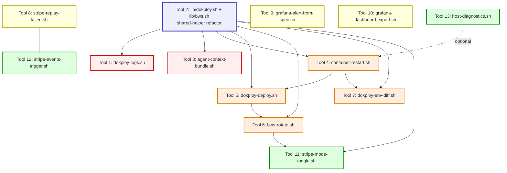

# polysim-bootstrap — tools roadmap (2026-05-17)

> **Status:** design proposal. No implementation in this PR. Each of the 12 tools
> below will ship as its own follow-up PR, tracked under the four tier issues
> linked at the bottom of this document.

---

## Background

`polysim-bootstrap` today is four single-file bash scripts plus a config-symlink
helper:

| Script | Purpose | LOC |
|---|---|---|
| `bootstrap/install.sh` | One-shot deterministic dev-machine setup (apt/dnf, fnm, uv, bun, bws, gh, claude, zellij, stripe-cli, mcp-grafana). Idempotent. | ~450 |
| `bootstrap/link-configs.sh` | Symlink shell + tmux + direnv + zellij configs from this repo into `$HOME`. Idempotent, backs up real files to `*.bak-<timestamp>`. | ~50 |
| `bootstrap/sync-secrets.sh` | Pull secrets from Bitwarden Secrets Manager (`bws`) into `<polysim-repo>/.env`, layered with `.env.defaults*`. Routes `SSH_KEY_*`/`SSH_PUB_*` to `~/.ssh/<name>`. | ~270 |
| `bootstrap/sync-dokploy-env.sh` | Push the same layered `.env.defaults*` to a Dokploy compose's environment-variables panel via the Dokploy REST API. `--skip-empty` by default to avoid BLAT'ing bws-managed secrets. | ~495 |

These four scripts are **setup tools** — you run them once on a new machine, then
mostly forget about them until a secret rotates or a new defaults key lands.

### The first "operational tool" landed in PR #4

[PR #4](https://github.com/Bavariance/polysim-bootstrap/pull/4)
(`bootstrap/push-bws-key-to-dokploy.sh`) is the first script in this repo that's
intended to be run **daily**, not "once per machine." It pushes a single
bws-managed secret to a Dokploy compose's env panel and optionally triggers a
`compose.deploy` to re-render the on-host `.env`. That gap (no clean way to
rotate one secret without running the whole bulk-sync) was previously closed
with hand-rolled `curl | jq` pipelines.

PR #4 also shipped `docs/improvements-survey-2026-05-17.md`, which catalogues
the technical-debt items in the existing four scripts (P1 + P2 + open
questions). This roadmap document is the **forward-looking** companion to that
survey: not "what to clean up in the existing scripts," but "what new tools
should the repo grow into."

---

## Vision

`polysim-bootstrap` evolves from a one-time setup kit into a **daily-driver
operations toolkit** for any team running a similar deployment stack:

> **Dokploy** for compose orchestration, **Bitwarden Secrets Manager** for
> secrets, **Stripe** for billing, and **Grafana + Loki + Prometheus** for
> observability.

Today every operational task lives somewhere off-repo: a CLAUDE.md cheat-sheet
section, a one-off bash function in the operator's shell history, a hand-rolled
`curl` against the Dokploy REST API, a manual click in the Dokploy or Grafana
UI. Each of those is fine in isolation, but together they form an
**unversioned, undiscoverable, untestable** operations surface.

This roadmap turns that surface into a public, versioned, dry-run-able CLI
toolkit. Every tool follows the same conventions; every tool has `--help`;
every state-mutating tool has `--dry-run`; every secret-touching tool redacts
values from stderr.

### Why a public reference implementation

The repo is intentionally **public**. None of the code is polysim-specific past
a few hard-coded env names and the default Dokploy server URL — everything else
is generic to the Dokploy + bws + Stripe stack. Any OSS operator running the
same stack should be able to fork this repo, change three constants, and have a
working operations toolkit.

The non-goal here is "a tool for every conceivable Dokploy or Stripe use case."
The goal is: **everything we run by hand more than once a week should be a
script in this repo.**

---

## Design principles

Adopted from the existing four scripts (and PR #4):

1. **Single-file POSIX-ish bash.** No Python / Node / Go dependencies for the
   core scripts. The user has bash, `curl`, `jq`, `awk`, `sed`, and (if
   touching Dokploy) the `bws` CLI. That's it. The bootstrap **installs** uv
   and Node and Python; the tools themselves don't depend on them.

2. **Consistent auth precedence everywhere:**
   ```
   $VAR env var  →  bws  →  legacy plaintext key file
   ```
   Same order in `sync-secrets.sh`, `sync-dokploy-env.sh`, and
   `push-bws-key-to-dokploy.sh`. Same will hold for every new Dokploy- or
   Stripe-touching tool.

3. **Self-documenting `--help`.** Each script's `--help` is generated by
   `sed`-extracting the header comment block. To extend the help, you extend
   the header — no separate man-page to drift. Pattern:
   ```bash
   -h|--help) sed -n '2,86p' "$0" | sed 's/^# \{0,1\}//'; exit 0 ;;
   ```

4. **`--dry-run` is mandatory** for any state-mutating script. The dry-run
   output must show the same diff the script would actually apply, with secret
   values redacted (length-only).

5. **Secret redaction enforced everywhere.** Never log a secret value — only
   `length=N` summaries. Pattern from `push-bws-key-to-dokploy.sh`:
   ```bash
   log "Resolved secret: $KEY_NAME (length=${#SECRET_VALUE}, value REDACTED)"
   ```

6. **Idempotent by default.** Re-running with the same inputs must be a no-op.
   `install.sh` checks `command -v <tool>` before installing; `link-configs.sh`
   leaves correct symlinks alone; `push-bws-key-to-dokploy.sh` detects
   `UNCHANGED` and exits 0 without writing.

7. **Shared helpers live in `bootstrap/lib/`** once 3+ scripts duplicate them.
   The `log` / `warn` / `die` colour-prefix helpers, the auth-resolution block,
   the compose-id map, and `post_dokploy` are already duplicated across
   `sync-dokploy-env.sh` and `push-bws-key-to-dokploy.sh`. The Tier 1 refactor
   (Tool 2) hoists them before adding more scripts that would copy them.

8. **`NO_COLOR=1` honoured.** All ANSI-coloured `log`/`warn`/`die` output
   collapses to plain text when `NO_COLOR=1` is set (per
   [no-color.org](https://no-color.org/)). Critical for CI runs and hook
   integration.

9. **No real secrets, compose IDs, or hostnames in committed code.** See
   [Public-repo redaction policy](#public-repo-redaction-policy) below — the
   one place where the four existing scripts already drift slightly (hard-coded
   composeIds, default `hosting.wladefant.de` URL) is grandfathered, but no new
   scripts should add to that drift.

---

## Tool roadmap

Four tiers, twelve tools, plus one shared-library refactor that needs to land
before most of Tiers 2–4.

### Tier 1 — incident triage (highest frequency)

These three exist to compress the highest-frequency operator loops:
"something's wrong, what's going on right now?" Their cost-of-not-existing is
counted in minutes saved per incident.

---

#### Tool 1: `dokploy-logs.sh`

**Purpose.** One-command wrapper around the three-step Dokploy log fetch:
`compose.one` → resolve `appName` → `docker.getContainersByAppNameMatch` →
`compose.readLogs`, with client-side filtering layered on top.

**Why it matters.** Today every operator who needs container logs has to
remember the three-step recipe, paste it into a shell, then **also** know that
the server-side `search=` param is broken (returns HTTP 500 on zero matches
because `grep` exits non-zero on no-match and the server treats that as
failure). Every fresh debugging session burns 2–3 minutes re-deriving the
recipe. With this wrapper, it's:

```bash
# Tail the last 10 minutes of the backend container's logs
./bootstrap/dokploy-logs.sh prod --service backend --since 10m

# Filter for a specific logger (client-side grep; the server-side filter is broken)
./bootstrap/dokploy-logs.sh prod --service backend --since 1h --grep alert_engine

# Wide window for build-log archaeology
./bootstrap/dokploy-logs.sh staging --service backend --since 6h --tail 5000
```

**Behaviour outline:**

- Positional `<env>` resolves to `composeId` via the shared compose-id map.
- `--service` (`backend|frontend|daemon|redis|...`) → filter to one container
  by short name (mapped from the compose service name).
- `--since 10m|1h|1d|all` and `--tail N` (default `since=10m`, `tail=200`).
- `--grep PATTERN` runs client-side (`| grep -iE`) because the Dokploy
  `search=` param errors on zero matches.
- `--container <id>` for direct container-id targeting (bypasses service map).
- `--follow` polls every 2 s (since the WS endpoint is build-log-only — see
  the build-log subsection of the Dokploy log recipe in the operator's
  CLAUDE.md). For now: keep it polling-based, document the limitation.
- Output is `docker logs --timestamps` format, exactly as Dokploy returns.
- Pretty-prints common JSON-log structures if `--json` flag is set (uses `jq
  -c` to flatten one log line per row).

**Dependencies.** Needs `lib/dokploy.sh` (Tool 2) for auth + compose-id +
`post_dokploy`. Without the lib, would duplicate ~80 lines.

**Estimated complexity.** **S** (~200 LOC including arg parsing + help).

---

#### Tool 2: `lib/dokploy.sh` + `lib/bws.sh` (shared-helper refactor)

**Purpose.** Hoist the helpers currently duplicated across `sync-dokploy-env.sh`
and `push-bws-key-to-dokploy.sh` into sourced libraries. Must land **before**
Tools 1, 4, 5, 6 (anything else that touches Dokploy or bws).

**Why it matters.** Right now ~140 lines of identical code live in two scripts:

| Helper | `sync-dokploy-env.sh` | `push-bws-key-to-dokploy.sh` |
|---|---|---|
| `log` / `warn` / `die` colour-prefix functions | yes (lines 67–69) | yes (lines 89–91) |
| Dokploy auth resolution (env → bws → key file) | yes (~50 lines) | yes (~50 lines) |
| Compose-id map (prod/staging/staging-api/staging3) | yes (~14 lines) | yes (~14 lines) |
| `post_dokploy` curl wrapper | yes (~24 lines) | yes (~24 lines) |
| bws `secret list` + `jq` extract pattern | yes (~30 lines) | yes (~30 lines) |

If Tool 1 (`dokploy-logs.sh`) or Tool 4 (`container-restart.sh`) lands without
this refactor, that's THREE scripts with the same 140-line boilerplate. Drift
will become inevitable.

**Usage** (illustrative — each consumer script `source`s the lib at startup):

```bash
# bootstrap/dokploy-logs.sh
#!/usr/bin/env bash
set -euo pipefail
SCRIPT_DIR="$(cd "$(dirname "${BASH_SOURCE[0]}")" && pwd)"
# shellcheck source=lib/dokploy.sh
. "$SCRIPT_DIR/lib/dokploy.sh"
# shellcheck source=lib/bws.sh
. "$SCRIPT_DIR/lib/bws.sh"

DOKPLOY_LOG_TAG="dok-logs"

dokploy_resolve_auth                # sets DOKPLOY_API_KEY + DOKPLOY_URL
COMPOSE_ID="$(dokploy_resolve_compose_id "$ENV_NAME")"
LOGS="$(dokploy_post compose.readLogs '{"composeId":"...","containerId":"...","tail":200,"since":"10m"}' "fetch logs")"
```

**Behaviour outline:**

- `bootstrap/lib/dokploy.sh` exposes:
  - `dokploy_log` / `dokploy_warn` / `dokploy_die` (uses `${DOKPLOY_LOG_TAG:-dok}`)
  - `dokploy_resolve_auth` — runs the env → bws → key-file precedence chain,
    sets `DOKPLOY_API_KEY` + `DOKPLOY_URL`, logs the source.
  - `dokploy_resolve_compose_id <env>` — echoes the composeId for a known env
    name, or returns 1 (caller decides whether to die or fall back to
    `--compose-id`).
  - `dokploy_post <endpoint> <json-body> <label>` — the captured-status-code
    POST wrapper currently named `post_dokploy` in both scripts.
  - `dokploy_get <endpoint?queryString> <label>` — symmetric GET helper
    (currently inlined as `curl -fsS ...`).
- `bootstrap/lib/bws.sh` exposes:
  - `bws_resolve_auth` — runs the env-var-or-file precedence for
    `BWS_ACCESS_TOKEN`, `BWS_PROJECT_ID`, `BWS_SERVER_URL`.
  - `bws_fetch_secret <key> [--strip-quotes]` — single-key extract from the
    cached project secret list, with the same `"..."` strip behaviour
    `push-bws-key-to-dokploy.sh` ships.
  - `bws_fetch_all_secrets` — returns the full `bws secret list -o json` blob,
    cached for the lifetime of the script in a `$BWS_SECRETS_JSON` global.
- Both libs honour `NO_COLOR=1` (collapse ANSI codes to plain text).
- Each lib is `shellcheck`-clean and self-contained — no cross-lib coupling.

**Dependencies.** None — this IS the dependency for most of the rest.

**Estimated complexity.** **M** (~300 LOC across both libs, but mechanical
work: lifting existing code into functions and updating callsites). The risk
isn't writing the libs; it's making sure the existing two scripts continue to
work identically after the refactor. **Required:** dry-run-and-diff regression
test against `sync-dokploy-env.sh` and `push-bws-key-to-dokploy.sh` outputs
before/after.

---

#### Tool 3: `agent-context-bundle.sh`

**Purpose.** Emit a single JSON or Markdown snapshot of "what's going on across
the deployment right now" — for dispatching to a subagent (or for the operator
themselves coming back after a few hours away).

**Why it matters.** When the operator (human or agent) starts a new debugging
session, the first 5–10 minutes are spent **gathering context**: which PRs are
open? Which were merged recently? Which composes are healthy? When did each
last deploy? Was there an incident in the last few hours? Today this means 4–6
separate tool calls / browser tabs. With this script, it's one command, and
the output is structured well enough that a subagent can be dispatched without
re-doing the discovery work.

**Usage:**

```bash
# Markdown summary for the operator to read
./bootstrap/agent-context-bundle.sh --last-hours 4

# JSON, suitable for piping into a Claude Code subagent prompt
./bootstrap/agent-context-bundle.sh --last-hours 4 --format json > /tmp/ctx.json

# Bundle into a single file for sharing across agents
./bootstrap/agent-context-bundle.sh --out /tmp/context-$(date +%s).md
```

**Behaviour outline:**

- Open PRs per repo with reviewer state (Copilot reviewed? Codex reviewed?
  Mergeable?). Uses `gh pr list --json` + `gh pr view <N> --json`.
- Recently-merged PRs in the last N hours.
- For each compose in the compose-id map: `compose.one.deployments[0].status`
  + `createdAt` + container uptime.
- Recent deploys (last N hours) with `done|error|running` status.
- (Optional, only if Grafana auth is configured) Active alert state via the
  Grafana MCP / API.
- (Optional, only if Stripe auth is configured) Last N failed webhook
  deliveries.
- Two output formats: `--format markdown` (human-readable, default) and
  `--format json` (machine-parseable; agent-friendly).
- All "optional" sources fail soft — if Grafana auth isn't on the box, the
  output omits the alert section rather than failing the whole script.

**Dependencies.** `lib/dokploy.sh` (Tool 2). Optionally `gh` (always available
post-`install.sh`).

**Estimated complexity.** **M** (~400 LOC because of the multiple data
sources and the JSON-vs-markdown rendering branch).

---

### Tier 2 — frequent ops (weekly)

These compress the weekly operator loops: deployments, restarts, rotations,
"is the env actually live?"

---

#### Tool 4: `container-restart.sh`

**Purpose.** SSH to the deployment host, `docker restart <container>`, wait for
the container's healthcheck to go green.

**Why it matters.** The "wedge-recovery" pattern documented in the operator's
CLAUDE.md is: when a Dokploy `compose.redeploy` returns success but no new
deployment fires (because the existing container is stuck in `(unhealthy)`),
you have to either `compose.stop` + `compose.deploy` (Tool 5) **or** SSH in
and `docker restart` the wedged container directly. The latter is faster (no
rebuild) but has to be done over SSH today.

Some workloads (jest-worker children pinning CPU, an unmounted volume after a
host reboot, a runaway log-flush loop) also need a plain `docker restart`
without any deploy at all.

**Usage:**

```bash
# Restart the prod backend, wait up to 60s for healthcheck to pass
./bootstrap/container-restart.sh prod backend --wait-healthy 60

# Restart the staging frontend without waiting
./bootstrap/container-restart.sh staging frontend --no-wait

# Dry-run: print what would happen
./bootstrap/container-restart.sh prod backend --dry-run
```

**Behaviour outline:**

- `<env>` → composeId → `appName` (via Dokploy `compose.one`).
- `<service>` (`backend|frontend|daemon|redis|...`) → resolves to a specific
  container ID via `docker.getContainersByAppNameMatch`.
- Reads `~/.ssh/config` `Host`-alias for the deployment host (configurable via
  `--host` override).
- Runs `ssh <host> docker restart <container>` and captures the new container
  ID.
- Polls `docker inspect --format '{{.State.Health.Status}}'` until `healthy`
  or `--wait-healthy` deadline.
- Logs every poll attempt (helpful for catching stuck startups).
- `--dry-run` prints the SSH command and target container without executing.

**Dependencies.** `lib/dokploy.sh` (Tool 2). The deployment host must be
SSH-reachable from the operator's box (already set up via the `SSH_KEY_*` /
`SSH_PUB_*` bws routing).

**Estimated complexity.** **S** (~180 LOC).

---

#### Tool 5: `dokploy-deploy.sh`

**Purpose.** Replace the polysim-specific `dokploy_deploy_manual.sh` (which
lives in the polysimulator repo, not here) with a generic, public,
multi-mode deploy wrapper. Critically: exposes the `compose.deploy` vs
`compose.redeploy` distinction in the CLI surface.

**Why it matters.** The Dokploy REST API has two superficially similar
endpoints with one critical difference:

| Endpoint | Effect | When to use |
|---|---|---|
| `compose.deploy` | Pulls latest from the configured branch, **re-renders the on-host `.env` from stored env**, runs `docker compose up -d --build`. | After **any env-var change** in the Dokploy stored env. |
| `compose.redeploy` | Same code path **but reuses the cached on-host `.env`**. | After a code-only change (no env mutation). |

Confusing these two is how we got the "I pushed the rotated secret to Dokploy
and triggered a redeploy but the running container still has the old value"
class of bug. This script makes the distinction explicit:

```bash
# After an env change in the Dokploy panel (most common case after bws rotation)
./bootstrap/dokploy-deploy.sh prod --mode rebuild --wait

# After a code-only merge (no env change)
./bootstrap/dokploy-deploy.sh prod --mode cached

# Wedge-recovery: stop + deploy (clears unhealthy container, forces fresh build)
./bootstrap/dokploy-deploy.sh prod --mode force-restart

# Status only, no action
./bootstrap/dokploy-deploy.sh prod --status

# Restart a single service (proxies to Tool 4)
./bootstrap/dokploy-deploy.sh prod --service backend --restart
```

**Behaviour outline:**

- `--mode rebuild` → `compose.deploy` (re-renders on-host `.env`, default for
  env changes).
- `--mode cached` → `compose.redeploy` (faster, no `.env` re-render).
- `--mode force-restart` → `compose.stop` + sleep + `compose.deploy` (the
  wedge-recovery flow from CLAUDE.md). Prints a warning that the compose
  will be DOWN for the duration of the rebuild.
- `--wait` polls `compose.one.deployments[0].status` until `done` or `error`
  (10 min default deadline, configurable via `--wait-timeout`).
- `--status` prints `deployments[0]` without triggering anything.
- `--title "<message>"` (optional) sets the deploy title visible in the
  Dokploy UI.
- `--verify-env KEY1,KEY2` (optional) after a `done` deploy, `docker exec`s
  the backend container and runs `env | grep -E '^(KEY1|KEY2)='` over SSH —
  this is the verification step CLAUDE.md flags as critical after env
  mutations.

**Dependencies.** `lib/dokploy.sh` (Tool 2). Tool 4 for the
`--service ... --restart` proxy. SSH access for `--verify-env`.

**Estimated complexity.** **M** (~350 LOC because of the three modes + polling
+ verify-env subsystem).

---

#### Tool 6: `bws-rotate.sh`

**Purpose.** Atomic secret-rotation flow: read new value (file or stdin),
push to bws, push to each listed Dokploy stored env, trigger
`compose.deploy` on each compose, verify env var landed in containers.

**Why it matters.** Today a "rotate STRIPE_SUBSCRIPTION_WEBHOOK_SECRET" task
involves 6–10 manual steps spread across 3 systems:

1. Generate the new value in the Stripe Dashboard.
2. Update bws via the CLI or web UI.
3. Run `push-bws-key-to-dokploy.sh --env prod --key … --deploy`.
4. Wait for deploy to finish.
5. Verify the env var landed in the prod container.
6. Repeat steps 3–5 for `staging`.
7. (Optionally) repeat for `staging-api` and `staging3`.

This script chains all of those into one command, with confirmation
prompts at the destructive steps:

```bash
# Rotate from a file containing the new secret value
./bootstrap/bws-rotate.sh STRIPE_SUBSCRIPTION_WEBHOOK_SECRET \
  --from-file /tmp/new-secret.txt \
  --envs prod,staging \
  --deploy

# Rotate from stdin (paste the secret)
./bootstrap/bws-rotate.sh STRIPE_API_KEY_SECRET --envs prod --deploy
# → reads from stdin (TTY hidden), pushes to bws, push to Dokploy, deploy

# Dry-run (no bws write, no Dokploy push, no deploy — just print what would happen)
./bootstrap/bws-rotate.sh STRIPE_API_KEY_SECRET --envs prod --dry-run
```

**Behaviour outline:**

- Read new value: `--from-file <path>`, `--from-stdin` (default if TTY),
  or `--from-env <varname>`.
- Refuse to read from arg/positional — secrets must not appear in shell
  history.
- Confirm-prompt before the bws write (`y/N`, default N), unless
  `--yes` is set.
- Push to bws via `bws secret edit <id> --value <new>` (or `bws secret
  create` if the key doesn't exist yet).
- For each `--envs` entry: `push-bws-key-to-dokploy.sh <env> <key> --deploy`
  (or call the underlying lib directly to avoid the subprocess overhead).
- After each compose's deploy goes to `done`: `--verify-env <key>` over SSH
  (same step Tool 5 grew).
- Final summary: `[ok] prod [ok] staging [skip] staging-api`.
- Refuses to run for Dokploy-managed keys (`APP_NAME`,
  `COMPOSE_PROJECT_NAME`) — same blocklist as `push-bws-key-to-dokploy.sh`.
- `--no-verify` skips the SSH verification step (useful when SSH isn't
  available from the operator's box).

**Dependencies.** `lib/dokploy.sh` + `lib/bws.sh` (Tool 2). Tools 5 (deploy)
and `push-bws-key-to-dokploy.sh` (the single-key push). Optionally Tool 4
for SSH verification.

**Estimated complexity.** **L** (~500 LOC because of the multi-env loop +
SSH verification + the confirm-prompt UX). Also needs careful error
handling: if push to bws succeeds but Dokploy push to env #2 fails, the
operator needs to know exactly which envs were updated.

---

#### Tool 7 (bonus, slotted into Tier 2): `dokploy-env-diff.sh`

**Purpose.** Diff three views of a compose's environment: the **Dokploy stored
env panel**, the **on-host `.env`** file, and the **running container's
environment**. Surfaces the three classes of drift the operator hits the
most.

**Why it matters.** When a recently-rotated secret "didn't take effect," there
are three possible places the value can be stuck at the old version:

1. The Dokploy stored env panel (operator forgot to push).
2. The on-host `.env` (operator ran `compose.redeploy` not `compose.deploy`,
   so the panel was updated but the file wasn't re-rendered).
3. The running container (operator ran `compose.deploy` but the new container
   hasn't replaced the old one yet).

Today the operator has to manually run three commands and eyeball the
results. This tool runs all three and prints a colour-coded three-column
diff:

```bash
./bootstrap/dokploy-env-diff.sh prod

# Output (illustrative):
#                                  PANEL              .env               container
# STRIPE_API_KEY_SECRET            sk_live_NEW…       sk_live_NEW…       sk_live_OLD…   ← drift!
# STRIPE_PUBLISHABLE_KEY           pk_live_…          pk_live_…          pk_live_…
# DB_POOL_SIZE                     20                 20                 20
# LOKI_QUERY_USER                  alloy              alloy              (unset)        ← drift!
# …
# 47 total keys; 2 drifts detected; 12 panel-only; 1 container-only.
```

**Behaviour outline:**

- Pull stored env via `compose.one` (already in `lib/dokploy.sh`).
- SSH to the deployment host, `cat <onhost-env-path>` (path resolvable via
  Dokploy's `compose.one`).
- SSH and `docker exec <container> env` to capture the running container's
  env (or use `docker.getContainersByAppNameMatch` + `docker inspect`).
- Three-way diff: print only keys with at least one mismatch (or full
  table with `--all`).
- Filter to a single key with `--key STRIPE_SUBSCRIPTION_WEBHOOK_SECRET`.
- Redact secret values to `length=N` by default; full values shown only
  with `--show-values` (and only to a TTY — never if stdout is a pipe).
- Exit code: 0 if no drift, 1 if any drift, 2 on error.

**Dependencies.** `lib/dokploy.sh` (Tool 2), SSH access to the deployment
host. Reuses container-resolution logic from Tool 4.

**Estimated complexity.** **M** (~300 LOC, but the SSH + jq plumbing is
fiddly).

---

### Tier 3 — observability + DR

These cover the lower-frequency-but-higher-stakes flows: alerts as code,
dashboards as code, replaying failed webhooks during incident recovery.

---

#### Tool 8: `stripe-replay-failed.sh`

**Purpose.** List failed Stripe webhook deliveries, optionally filter, bulk
re-send with confirmation, report success/fail counts. Replaces manually
clicking "Resend" in the Stripe Dashboard during incident recovery.

**Why it matters.** When the deployment goes down for a window (orphan-connection
self-lock, FE SSR pool starvation, mis-deployed cert, etc.), Stripe queues
deliveries and after retry exhaustion they show up as Failed in the
Webhook dashboard. The recovery flow today is: click each failed delivery,
click "Resend," wait, repeat — for sometimes dozens of deliveries. With
this script:

```bash
# List failed deliveries for a webhook in the last 24h
./bootstrap/stripe-replay-failed.sh we_xxx --since 24h --dry-run

# Filter by event type (only replay subscription-related events)
./bootstrap/stripe-replay-failed.sh we_xxx --since 24h --type 'customer.subscription.*' --dry-run

# Actually resend (confirmation prompt before bulk-resend)
./bootstrap/stripe-replay-failed.sh we_xxx --since 24h --type 'customer.subscription.*'
```

**Behaviour outline:**

- Uses the Stripe CLI (`stripe events list --delivery-success false --limit
  100`) — installed by `install.sh`.
- Filter by `--since DATE` (any ISO timestamp or `24h`-style relative),
  `--type GLOB` (e.g. `customer.subscription.*`).
- Default is `--dry-run` (list only). Operator must add `--apply` to
  actually resend.
- For each candidate delivery: `stripe events resend <event-id>
  --webhook-endpoint <webhook-id>`.
- Capture per-event success/fail; print summary at end.
- Refuse to run without a Stripe API key resolvable from env / bws (same
  precedence as the Dokploy scripts).
- `--mode live|test` toggles which Stripe environment is used.

**Dependencies.** Stripe CLI (`install.sh`). `lib/bws.sh` for auth
resolution. No Dokploy dependency.

**Estimated complexity.** **S** (~200 LOC; the Stripe CLI does most of the
heavy lifting).

---

#### Tool 9: `grafana-alert-from-spec.sh`

**Purpose.** Define alert rules as YAML files in `monitoring/alerts/`, sync
them to Grafana via API. Version-controlled alert rules.

**Why it matters.** Today every alert in our Grafana lives only inside
Grafana — there's no source of truth in git, no code review on changes,
and silent edits in the UI can drift the system from what the operator
**thinks** is monitored. Tools 9 and 10 together turn Grafana into a
declarative system (specs in git, periodic sync).

**Usage:**

```bash
# Sync all alerts in monitoring/alerts/ to the prod Grafana
./bootstrap/grafana-alert-from-spec.sh prod

# Sync one file
./bootstrap/grafana-alert-from-spec.sh prod --file monitoring/alerts/backend-5xx.yaml

# Dry-run: print diff vs Grafana state
./bootstrap/grafana-alert-from-spec.sh prod --dry-run

# Pull current Grafana state into the spec dir (for one-time migration)
./bootstrap/grafana-alert-from-spec.sh prod --import-from-grafana
```

**Behaviour outline:**

- YAML schema:
  ```yaml
  alert:
    uid: backend-5xx-rate-prod
    title: "Prod backend 5xx rate"
    folder: backend
    interval: 1m
    queries:
      - refId: A
        datasourceUid: prometheus
        expr: |
          sum(rate(http_request_duration_seconds_count{status=~"5..",env="prod"}[5m]))
    condition:
      refId: A
      op: gt
      threshold: 5
    for: 5m
    annotations: {...}
    labels: {severity: page}
    notifications:
      - contactPoint: pagerduty
  ```
- Reads every `monitoring/alerts/*.yaml` in the polysim repo (configurable
  via `--dir`).
- For each file: compute the Grafana alert-rule payload, GET the existing
  rule by `uid`, diff, PUT if different.
- `--dry-run` prints the proposed diff per alert.
- Honours `--folder` to scope sync to one folder (avoids accidentally
  blasting unrelated alerts).
- `--prune` deletes Grafana alerts whose `uid` no longer appears in the
  spec dir (off by default; explicit opt-in only).
- Auth: Grafana API key resolution via env → bws → key file (same
  precedence as Dokploy).

**Dependencies.** Grafana API key in bws. `yq` (YAML parsing) — add to
`install.sh` as a hard dep; otherwise this is the only script using
`yq`.

**Estimated complexity.** **L** (~550 LOC because of the YAML schema
validation + the Grafana payload shape + the per-alert diff logic).

---

#### Tool 10: `grafana-dashboard-export.sh`

**Purpose.** Pull dashboard JSON from Grafana into the spec dir for
version control. Companion to Tool 9, but read-only on Grafana (just
exports state for backup / review).

**Why it matters.** Same reason as Tool 9 (no source of truth in git),
but for dashboards. Dashboard JSON is verbose (often >1000 lines per
dashboard), so the workflow is: export-on-demand → commit → review.

**Usage:**

```bash
# Export all dashboards in the "backend" folder
./bootstrap/grafana-dashboard-export.sh --folder backend --out monitoring/dashboards/

# Export one dashboard by uid
./bootstrap/grafana-dashboard-export.sh --uid backend-overview --out monitoring/dashboards/

# Diff current Grafana vs the on-disk version
./bootstrap/grafana-dashboard-export.sh --uid backend-overview --diff
```

**Behaviour outline:**

- GET `/api/dashboards/uid/<uid>` for each requested dashboard.
- Strip mutable fields (`version`, `id`, `iteration`) before writing —
  these change on every UI save and would make every diff noisy.
- Pretty-print JSON via `jq --sort-keys -S` (stable ordering for clean
  diffs).
- Write to `<out>/<folder>-<uid>.json`.
- `--diff` shows `git diff`-style comparison without writing.
- `--all` exports every dashboard the API key can read (with `--folder`
  to scope).
- Companion `--import` mode pushes the on-disk JSON back to Grafana
  (for restore-from-backup). Default off; explicit `--import` required.

**Dependencies.** Grafana API key (same resolution as Tool 9).

**Estimated complexity.** **S** (~200 LOC; the Grafana dashboard API is
straightforward, most LOC is in the field-stripping + sort-keys logic).

---

### Tier 4 — workflow polish

These compress the lowest-frequency-but-highest-friction flows: Stripe mode
toggles, Stripe webhook scenario simulation, host diagnostics for the
"my-host-is-on-fire" case.

---

#### Tool 11: `stripe-mode-toggle.sh`

**Purpose.** Flip all `STRIPE_*` environment variables in a target Dokploy env
between live and test mode, then redeploy.

**Why it matters.** Switching a staging compose between Stripe live mode
(for end-to-end testing with real money) and Stripe test mode (for general
QA) is a 8-step manual flow today: stop traffic, open Dokploy panel,
locate every `STRIPE_*` var, replace value with the test/live counterpart,
deploy, verify env in container. Error-prone and easy to leave one var
half-migrated.

**Usage:**

```bash
# Flip staging to Stripe live mode
./bootstrap/stripe-mode-toggle.sh staging live --deploy

# Flip back to test mode (dry-run first)
./bootstrap/stripe-mode-toggle.sh staging test --dry-run
```

**Behaviour outline:**

- Reads the list of `STRIPE_*` keys from a config file (e.g.
  `~/.config/polysim/stripe-mode-map.yaml`) that maps each key to its
  live-mode and test-mode bws secret names. Example:
  ```yaml
  STRIPE_API_KEY_SECRET:
    live: STRIPE_API_KEY_SECRET
    test: STRIPE_API_KEY_SECRET_TEST
  STRIPE_PUBLISHABLE_KEY:
    live: STRIPE_PUBLISHABLE_KEY
    test: STRIPE_PUBLISHABLE_KEY_TEST
  STRIPE_SUBSCRIPTION_WEBHOOK_SECRET:
    live: STRIPE_SUBSCRIPTION_WEBHOOK_SECRET
    test: STRIPE_SUBSCRIPTION_WEBHOOK_SECRET_TEST
  ```
- For each entry: fetch the appropriate bws secret, push to Dokploy panel
  via the `push-bws-key-to-dokploy.sh` logic (or call the lib directly).
- `--deploy` triggers `compose.deploy` after all pushes complete.
- `--dry-run` prints the per-key diff without writing.
- Refuses to run against `prod` unless `--allow-prod` is passed (extra
  guard against accidentally flipping production into test mode).

**Dependencies.** `lib/dokploy.sh` + `lib/bws.sh` (Tool 2). Tool 6 (or
the underlying push-bws-key logic).

**Estimated complexity.** **S** (~200 LOC; mostly arg parsing + iterating
the config file).

---

#### Tool 12: `stripe-events-trigger.sh`

**Purpose.** Wrap `stripe trigger` for the common scenarios we use during
development and incident reproduction.

**Why it matters.** `stripe trigger pro-signup` is what every operator
**wants** to type. What they currently have to type is a multi-line shell
incantation with the right combination of `--add` flags to create a
realistic event for a specific customer. This script collapses the common
scenarios into named arguments.

**Usage:**

```bash
# Simulate a Pro tier signup (creates a customer + subscription + invoice + payment_intent.succeeded)
./bootstrap/stripe-events-trigger.sh pro-signup --customer-email test@example.com

# Simulate a cancellation
./bootstrap/stripe-events-trigger.sh pro-cancel --subscription sub_xxx

# Simulate a payment failure
./bootstrap/stripe-events-trigger.sh payment-failed --customer-email test@example.com

# Simulate a refund
./bootstrap/stripe-events-trigger.sh refund --charge ch_xxx
```

**Behaviour outline:**

- Hardcoded list of named scenarios (`pro-signup`, `pro-cancel`,
  `payment-failed`, `refund`, more as discovered).
- Each scenario maps to one or more `stripe trigger <event-name>
  --add ...` calls with the right param shape.
- `--customer-email` / `--subscription` / `--charge` flags vary per
  scenario.
- `--mode live|test` (default `test`) gates which Stripe environment is
  used. Live mode requires explicit `--yes-i-know` (no accidental real
  charges).
- Output: human-readable summary of what was triggered + the event IDs.
- `--list-scenarios` prints all available scenarios with their flags.

**Dependencies.** Stripe CLI (`install.sh`). No Dokploy dependency.

**Estimated complexity.** **S** (~250 LOC; each scenario is a small
function).

---

#### Tool 13 (counted as Tier 4 since it's the lowest-frequency): `host-diagnostics.sh`

**Purpose.** Wrap `top`, `docker stats`, `free`, `df`, `journalctl` over SSH
into structured output for agent parsing.

**Why it matters.** When the operator says "the host feels slow," the
investigation today involves SSHing in, running 5–6 commands by hand,
and eyeballing output that's optimised for humans (top's TUI table is
not parseable by `jq`). With this script:

```bash
# One-shot snapshot of a host's resource state, JSON output
./bootstrap/host-diagnostics.sh hetzner-ashburn1 --since 1h --format json

# Markdown summary
./bootstrap/host-diagnostics.sh hetzner-ashburn1 --since 1h

# Filter to one section
./bootstrap/host-diagnostics.sh hetzner-ashburn1 --section docker-stats
```

**Behaviour outline:**

- SSH to `<host>` (alias from `~/.ssh/config`).
- Captures:
  - `top -bn1 -o %CPU | head -30` → top processes by CPU.
  - `top -bn1 -o %MEM | head -30` → top processes by memory.
  - `docker stats --no-stream --format '{{json .}}'` → per-container
    CPU/mem/IO.
  - `free -m` → host memory.
  - `df -h` → disk usage.
  - `journalctl -u docker --since "<--since>" | tail -100` → recent
    Docker daemon log (errors / warnings).
  - `uptime` → load averages.
  - `last -10` → recent SSH logins (useful for "was someone else on
    the box?").
- Output: structured JSON or rendered Markdown.
- `--section` to filter to one capture (top, docker-stats, mem, disk,
  journal).
- All captures are read-only — no state mutation on the host.

**Dependencies.** SSH access to the target host. No Dokploy dependency.

**Estimated complexity.** **M** (~350 LOC because of the
per-capture parsing + the two output formats).

---

## Implementation order + dependencies

The shared-helper refactor (Tool 2: `lib/dokploy.sh` + `lib/bws.sh`) MUST land
first. Everything else either depends on it directly or would duplicate the
helpers it consolidates.

After Tool 2, the rest can land in roughly parallel streams — the dependency
graph is shallow.



Recommended landing order (one PR per arrow group):

1. **Tool 2** (the shared-helper refactor) — must come first. Regress-test the
   two existing scripts (`sync-dokploy-env.sh`, `push-bws-key-to-dokploy.sh`)
   by running their `--dry-run` output before/after the refactor and asserting
   byte-identical results.
2. **Tools 1, 3, 4** in parallel (no inter-dependency past Tool 2).
3. **Tool 5** (`dokploy-deploy.sh`) — depends on Tool 4 for the `--service ...
   --restart` proxy mode.
4. **Tool 7** (`dokploy-env-diff.sh`) — depends on Tool 4's container
   resolution.
5. **Tool 6** (`bws-rotate.sh`) — depends on Tool 5 for the deploy step.
6. **Tools 8, 9, 10** (observability + Stripe replay) — all independent past
   the libs.
7. **Tools 11, 12, 13** (workflow polish) — fully independent.

Tools 8 + 12 share Stripe CLI knowledge; landing them in the same release
cycle lets the second reuse helper code from the first (a potential `lib/stripe.sh`
extraction if both ship close in time).

---

## Public-repo redaction policy

`polysim-bootstrap` is intentionally public, so contributed code must NOT
contain any value that's specific to the polysim deployment **and** sensitive
enough that someone scraping the repo could use it. Specifically:

### Must NOT be committed to this repo

| Class | Examples | Where it goes instead |
|---|---|---|
| Real Dokploy compose IDs | `qCKlu4fStE0xLfZRCKUdw`, `nG8qoVvsNNaMyycQ-OVZc`, ... | `~/.config/polysim/dokploy-compose-map.json` on the operator's box; documented as `<PROD_COMPOSE_ID>` etc. in this repo. |
| Real deployment hostnames | `hosting.wladefant.de`, `hetzner-ashburn1`, ... | `~/.config/polysim/dokploy-url`, `~/.ssh/config`. Documented as `<DOKPLOY_HOST>`, `<DEPLOYMENT_HOST_ALIAS>` here. |
| Stripe webhook IDs | `we_abc123…`, account-specific. | Operator types these into the CLI; no need to bake in. |
| Stripe Pricing IDs | `price_…`, account-specific. | Same — runtime args only. |
| Real Grafana / Loki / Prometheus URLs | `loki.polysimulator.com`, `grafana.polysimulator.com`. | `~/.config/polysim/grafana-url`, etc. Documented as `<GRAFANA_URL>` here. |
| Internal-only project refs | Supabase project refs, Cloudflare account IDs, bws project UUIDs. | Per-machine config; documented as `<SUPABASE_PROJECT_REF>` etc. here. |
| Any real secret value | API keys, JWT secrets, webhook secrets, OAuth client secrets, DB passwords. | bws only. Never committed. The `.gitignore` already blocks the common file patterns; PRs that add new file types should extend it. |

### Acceptable in this repo

| Class | Example |
|---|---|
| Generic CLI placeholders | `--compose-id <id>`, `--env staging`, `<key>` |
| Public Stripe event names | `customer.subscription.created`, `invoice.payment_failed` |
| Public API endpoints (Dokploy / Grafana shapes) | `/compose.one`, `/api/v1/provisioning/alert-rules` |
| Default-but-overridable URLs that are themselves public | `https://api.stripe.com`, `https://api.bitwarden.com` |
| The existing `hosting.wladefant.de` default URL in `sync-dokploy-env.sh:205` | (Grandfathered. Keep documenting as overridable; new scripts must use placeholders only.) |

### Placeholder pattern

In documentation:
```
DOKPLOY_URL=https://<DOKPLOY_HOST>/api
COMPOSE_ID=<PROD_COMPOSE_ID>
```

In script defaults: `${DOKPLOY_URL:-https://example.invalid/api}` — a default
that's obviously unusable, so the operator gets an immediate error and is
forced to configure it explicitly. (Exception: the existing
`hosting.wladefant.de` default is grandfathered for backwards-compat. New
scripts must use the `example.invalid` pattern.)

In the compose-id map: new scripts must NOT bake in the four polysim compose
IDs (`prod`, `staging`, `staging-api`, `staging3`). Instead:

```bash
# Resolve composeId from ~/.config/polysim/dokploy-compose-map.json
# (one-time setup; operator writes their own mapping)
dokploy_resolve_compose_id() {
  local env="$1"
  local map_file="$HOME/.config/polysim/dokploy-compose-map.json"
  [ -r "$map_file" ] || return 1
  jq -r --arg env "$env" '.[$env] // empty' "$map_file"
}
```

The existing two scripts (`sync-dokploy-env.sh`, `push-bws-key-to-dokploy.sh`)
that bake the map in are grandfathered — a follow-up cleanup PR can migrate
them to the JSON-map pattern once Tool 2 lands.

### Pre-commit guard

A pre-commit hook (or CI check) should reject any new commit that introduces
strings matching:

- `[A-Za-z0-9_-]{22}` (Dokploy compose-id shape — typically 22 chars,
  base64url) appearing in `bootstrap/lib/*.sh` or new scripts.
- `we_[A-Za-z0-9]{24,}` (Stripe webhook ID).
- `whsec_[A-Za-z0-9]{32,}` (Stripe webhook secret).
- `sk_(live|test)_[A-Za-z0-9]{24,}` (Stripe secret key).
- `(hosting|loki|grafana|api)\.wladefant\.de` outside the
  `sync-dokploy-env.sh` grandfathered default.

Tooling for this is out of scope of this roadmap (track separately).

---

## Tracking

Each tier has a GitHub issue that links back to the relevant section of this
document. PRs implementing individual tools should reference both this doc
and the parent tier issue.

- **Tier 1 — incident triage:** https://github.com/Bavariance/polysim-bootstrap/issues/6
- **Tier 2 — frequent ops:** https://github.com/Bavariance/polysim-bootstrap/issues/7
- **Tier 3 — observability + DR:** https://github.com/Bavariance/polysim-bootstrap/issues/8
- **Tier 4 — workflow polish:** https://github.com/Bavariance/polysim-bootstrap/issues/9

---

## Appendix: changelog from prior survey

This roadmap is the **forward-looking** companion to
`docs/improvements-survey-2026-05-17.md` (the technical-debt survey of the
existing four scripts). For clarity:

- **Survey** = "what to clean up in the existing four scripts."
- **Roadmap** = "what new tools the repo should grow into."

Both documents agree on:

- The `lib/dokploy.sh` extraction (survey P1 #2 ≡ roadmap Tool 2) must come
  before any new script that touches Dokploy.
- `dokploy-deploy.sh` (survey P1 #1 ≡ roadmap Tool 5) is the highest-value
  new wrapper.
- Open question 5 in the survey (compose.update race window) is a real risk
  once Tools 5, 6, 7, 11 land — multiple scripts may concurrently
  read-modify-write the same compose env. The roadmap defers this to a
  separate hardening pass; the lib should grow advisory locking before
  Tools 6 + 11 ship.

The survey's P2 items (e.g. `NO_COLOR=1`, summary blocks in `install.sh` +
`link-configs.sh`) should be addressed as opportunistic cleanups inside the
PRs that touch those files — they don't need standalone tracking.
